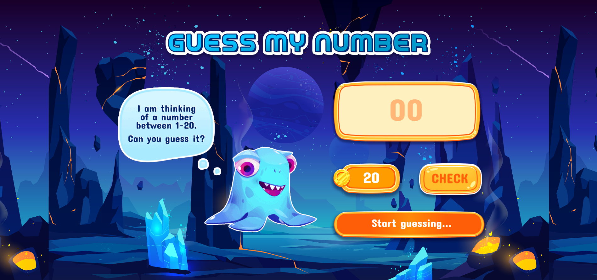
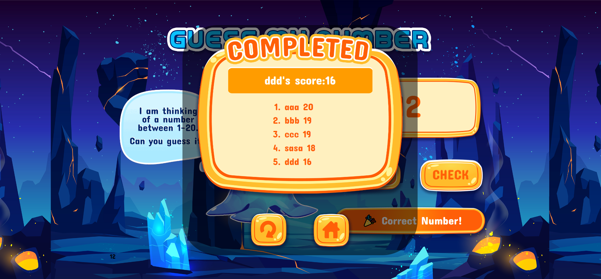

# Guess my Number - Hacktiv8 P0 Hackaton 

Kami membuat sebuah game sederhana yang memungkinkan user untuk menebak angka random dalam rentang angka 1-20

## Table of contents

- [Overview](#overview)
  - [Links](#links)
  - [The challenge](#the-challenge)
  - [Screenshot](#screenshot)

## Overview

### Links

- Live Site URL: [link](https://rocky3235.github.io/Guess-My-Number//)
- Solution URL: [link](https://github.com/Rocky3235/Guess-My-Number)

### The challenge
Step by Step Di Aplikasi Game Yang Bernama Guess My Number :
- Mententukan Konsep yang mau di kembangkan di Aplikasi Game Guess My Number
- Berdiskusi menentukan Interface tampilan Aplikasi Games tersebut,
- Berdiskusi untuk menetukan Alur Chart Games yang di tentukan

Users should be able to:

- View the optimal layout for the site depending on their device's screen size

### Screenshot
Home page :

Name input page :

Game page :

Score and leader board :

